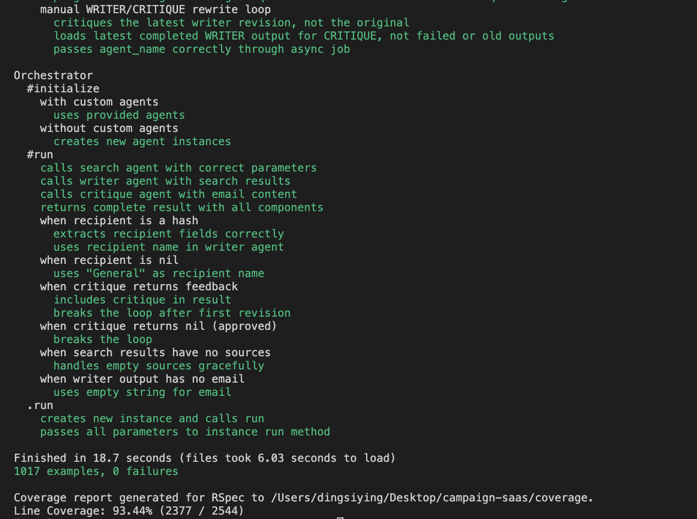
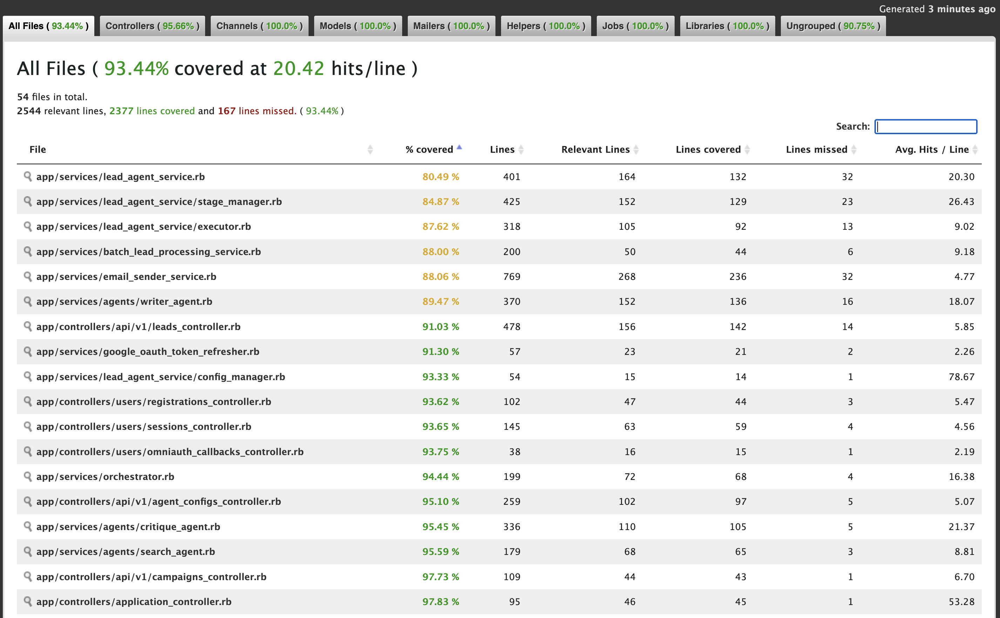
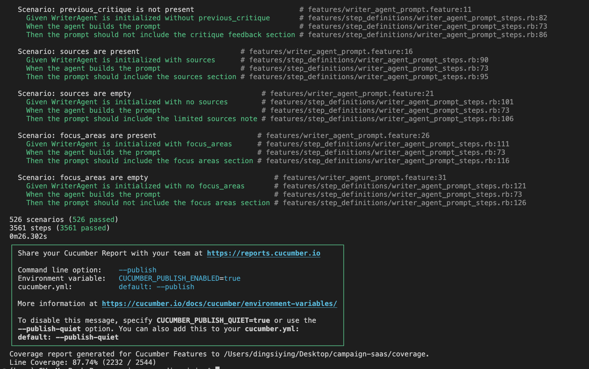
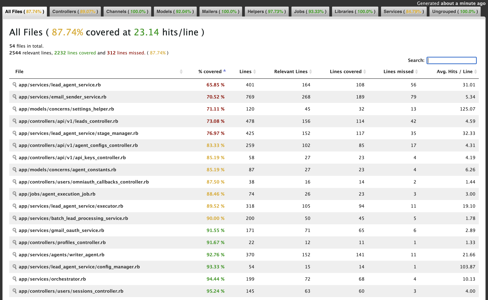

# CampAIgn - AI-Powered Campaign Management Platform

A modern SaaS application for managing AI-powered marketing campaigns with intelligent agent workflows.

**Built with:** Ruby on Rails 8.1, React 18, PostgreSQL, TypeScript

Clip from [demo video](https://youtu.be/YRCymhf2M9U?si=3CxA78A44HRBLUVm&t=676) showcasing how to use the app if needed

## Prerequisites

- **Ruby:** 3.3.9+
- **Rails:** 8.1
- **PostgreSQL:** 12+
- **Node.js:** 20.0.0+ (LTS 24.x recommended) ⚠️ **Required**
- **npm:** 10.7.0+

## Installation

### Quick Start (Recommended)
If you run into any problem when following the Quick Start instructions, please check out our curated [Troubleshooting section](#troubleshooting), where tested solutions to commonly encountered setup issues are provided.

If you prefer manually set up this project locally instead, please follow instructions in [Manual Setup section](#manual-setup-alternative)

```bash
# 1. Clone and enter the repository
git clone <your-repo-url>
cd campaign-saas

# 2. Install Node.js 20+ if needed
# Download from https://nodejs.org/ or use: nvm install 24 && nvm use 24

# 3. Run automated setup
bin/setup --skip-server

# 4. Install JavaScript dependencies
npm install

# 5. Start the application (two terminals)
# Terminal 1: Webpack dev server
./bin/webpack-dev-server

# Terminal 2: Rails server
rails server
```

Open **http://localhost:3000** - automatically logged in as `admin@example.com`

**Note:** The `.env` file is optional for development - defaults are provided. Create it with `cp .env.example .env` if you want to customize settings.

## RSpec and Cucumber Test Coverage Reports
*** Note: Please run rm -rf coverage in between running the RSpec and Cucumber test command in order to get the most accurate results for RSpec alone or Cucumber alone.
### RSpec
```bash
COVERAGE=TRUE bundle exec rspec
```
As shown in the screenshots below, all RSpec test cases passed. We are able to achieve 93%+ overall coverage.



### Cucumber
```bash
COVERAGE=TRUE bundle exec cucumber
```
As shown in the screenshots below, all Cucumber scenarios passed. We are able to achieve 87%+ overall coverage.



## Development

### Default User
- **Email:** `admin@example.com`
- **Password:** `password123`
- Authentication is disabled in development (auto-login)

### API Keys Setup
1. Start the application
2. Navigate to user profile → API Keys
3. Add your keys:
   - **Gemini API Key:** https://aistudio.google.com/app/apikey
   - **Tavily API Key:** https://tavily.com/

### Email Sending Setup

**Option 1: Use Your Own Gmail (Recommended)**
1. Set up Google OAuth Client in [Google Cloud Console](https://console.cloud.google.com/)
2. Enable Gmail API
3. Add redirect URIs:
   - `http://localhost:3000/users/auth/google_oauth2/callback`
   - `http://localhost:3000/oauth/gmail/callback`
4. Add to `.env`:
   ```env
   GOOGLE_CLIENT_ID=your-client-id
   GOOGLE_CLIENT_SECRET=your-client-secret
   GMAIL_CLIENT_ID=your-client-id
   GMAIL_CLIENT_SECRET=your-client-secret
   ```
5. Connect Gmail in the app via user profile

**Option 2: Use Default System Sender**
1. Create a Gmail account for the system
2. Set up OAuth (same as Option 1)
3. Add to `.env`:
   ```env
   DEFAULT_GMAIL_SENDER=system-email@gmail.com
   ```

**Email Sending Priority:** User Gmail OAuth → Default Gmail Sender → SMTP Fallback

## Project Structure

```
campaign-saas/
├── app/
│   ├── controllers/       # API & web controllers
│   ├── models/            # ActiveRecord models
│   ├── services/          # Business logic & AI agents
│   │   ├── agents/        # Agent implementations
│   │   └── lead_runs/     # Agent orchestration
│   ├── javascript/        # React/TypeScript frontend
│   ├── jobs/              # Background jobs
│   └── views/             # ERB templates
├── db/                    # Migrations & seeds
├── spec/                  # RSpec tests
├── features/              # Cucumber tests
└── config/                # Rails configuration
```

## AI Agent System

Multi-agent pipeline executes in order: **SEARCH → WRITER → CRITIQUE → DESIGN → SENDER**

### Agents

- **SEARCH** - Researches companies and recipients using Tavily API
- **WRITER** - Generates personalized B2B emails using Gemini API
- **CRITIQUE** - Reviews email quality (1-10 score), provides feedback
- **DESIGN** - Applies markdown formatting (bold, italic, bullets)
- **SENDER** - Delivers emails via Gmail API or SMTP

### Stage Progression

- **Normal flow:** `queued → searched → written → critiqued → designed → completed`
- **With rewrites:** `written → critiqued → rewritten (1) → critiqued → rewritten (2) → ... → designed → completed`

### Key Features

- Agents can be enabled/disabled per campaign
- Automatic rewrite cycles when critique score is below threshold (max 3 rewrites)
- Configurable settings per agent (tone, personalization, strictness, etc.)
- Variant generation and selection
- Quality scoring and feedback loop

## Available Scripts

```bash
# Database
rails db:setup         # Create, migrate, and seed
rails db:migrate       # Run migrations

# Development
rails server           # Start Rails server
./bin/webpack-dev-server  # Start Webpack dev server
rails console          # Open Rails console

# Testing
COVERAGE=TRUE bundle exec rspec            # Run RSpec tests
COVERAGE=TRUE bundle exec cucumber         # Run Cucumber tests
npm test                     # Run Jest tests
npm run test:coverage        # Run Jest tests with coverage

*** Note: Please run rm -rf coverage in between running the RSpec and Cucumber tests to get the most accurate results for RSpec alone or Cucumber alone.
```

## Production

### Environment Variables

Required:
- `GOOGLE_CLIENT_ID`, `GOOGLE_CLIENT_SECRET`
- `GMAIL_CLIENT_ID`, `GMAIL_CLIENT_SECRET`

Optional:
- `DEFAULT_GMAIL_SENDER` - System email sender
- `DISABLE_AUTH` - Set to `true` to disable auth (testing only)

### Deployment

1. Run migrations: `heroku run rails db:migrate -a <app>`
2. Set environment variables
3. Verify Gmail OAuth configuration

**Platform:** Heroku  
**URL:** https://campaign-saas-7460a258bf90.herokuapp.com/

### Required Environment Variables

Set environment variables via Heroku Config Vars:

```bash
# Google OAuth (required for Gmail sending)
heroku config:set GOOGLE_CLIENT_ID="your-client-id" -a campaign-saas
heroku config:set GOOGLE_CLIENT_SECRET="your-client-secret" -a campaign-saas
heroku config:set GMAIL_CLIENT_ID="your-client-id" -a campaign-saas
heroku config:set GMAIL_CLIENT_SECRET="your-client-secret" -a campaign-saas

# Optional: Default Gmail sender
heroku config:set DEFAULT_GMAIL_SENDER="system-email@gmail.com" -a campaign-saas

# API Keys (optional - users can add their own)
heroku config:set GEMINI_API_KEY="your_key" -a campaign-saas
heroku config:set TAVILY_API_KEY="your_key" -a campaign-saas
```

### Database Migrations

After deploying new migrations, run:

```bash
heroku run rails db:migrate -a campaign-saas
```

## Docker

```bash
docker build -t campaign_manager .
docker run -d -p 80:80 -e RAILS_MASTER_KEY=<value> --name campaign_manager campaign_manager
```

## Manual Setup (Alternative)

If you prefer manual setup:

1. **Install prerequisites:**
   - Ruby 3.3.9+
   - **Node.js 20.0.0+ (latest LTS 24.x recommended)** ⚠️ **REQUIRED**
     - Check version: `node --version`
     - Download: https://nodejs.org/
     - Or use nvm: `nvm install 24 && nvm use 24`
     - The `npm install` command will automatically verify Node.js version
   - PostgreSQL 12+
   - npm 10.7.0+ (comes with Node.js)

2. **Install dependencies:**
   ```bash
   bundle install
   npm install
   ```

3. **Setup database:**
   ```bash
   rails db:setup  # Creates, migrates, and seeds in one command
   ```

4. **Start the application:**
   ```bash
   # Terminal 1: Rails server
   rails server
   
   # Terminal 2: Webpack dev server (for hot reload)
   chmod +x ./bin/webpack-dev-server
   ./bin/webpack-dev-server
   ```

## Troubleshooting

### Node.js Version Issues

If you see an error like "Node.js version 20.0.0 or higher is required" during `npm install`:

1. **Check your current Node.js version:**
   ```bash
   node --version
   ```

2. **If version is too old (< 20.0.0), install the latest LTS:**
   ```bash
   # Option A: Download from https://nodejs.org/
   # Option B: Using nvm (if installed)
   nvm install 24
   nvm use 24
   # Or simply: nvm use (if .nvmrc exists)
   ```

3. **Verify the installation:**
   ```bash
   node --version  # Should show v20.x.x or higher
   ```

4. **Clear npm cache and retry:**
   ```bash
   npm cache clean --force
   npm install
   ```

**Note:** The `preinstall` script in `package.json` automatically checks Node.js version before installing dependencies. This ensures compatibility with Shakapacker (Webpack 5) which requires Node.js 20+.

### Database Connection Issues

If you see PostgreSQL connection errors:
- Ensure PostgreSQL is running: `pg_isready` or check your PostgreSQL service
- Verify database credentials in `config/database.yml`
- Check that the database exists: `rails db:create`

### Port Already in Use

If port 3000 is already in use:
```bash
rails server -p 3001
```

## Documentation

For comprehensive codebase documentation, see `COMPLETE_CODEBASE_ANALYSIS.md` in the repository root directory.
